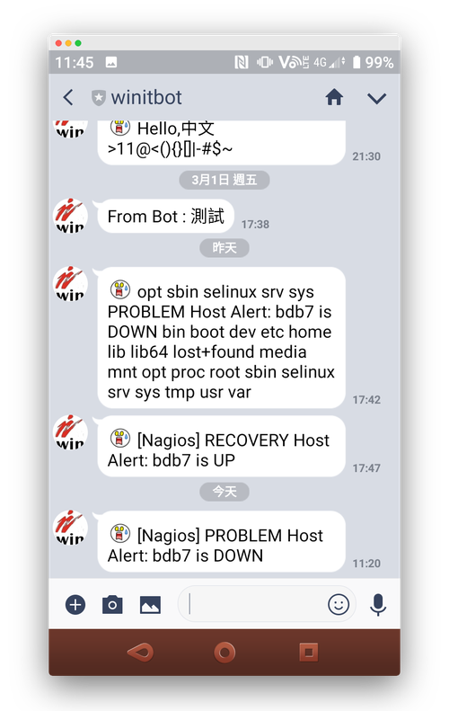
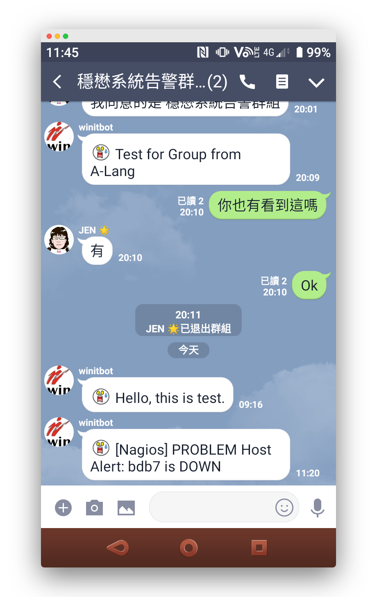
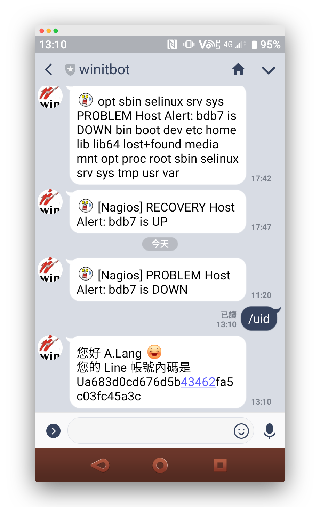

# LINE Bot

[LINE](https://line.me/zh-hant/) is the most popular IM app in Taiwan. I've been using [Nagios](https://www.nagios.org/) to monitor the servers in my company for a decade. I'd like to put both of them together so that the ability to send an alert of Nagios using an approach other than Email and SMS.

If you're interested in such application as well, you can find all you need here.

Hoping you enjoy it.

Sending to a LINE user

Sending to a LINE group

LINE Bot to return the userId info

 ## Requirement

- [LINE Developer Account](https://developers.line.biz/en/)
- [LINE APP Account](https://line.me/zh-hant/)
- [Nagios](https://www.nagios.org/) Monitor System
- Google Cloud Platform or self-hosted web server supported with SSL protocol

## Webhook

The PHP scripts are designed to obtain the userId of specified LINE user.

> NOTE: 
>
> - The userId is different from LINE ID found on LINE. 
> - To send a LINE message to someone's LINE account, the info of his userId is MUST to the LINE Messaging API.

### What's the userId?

| Property | Type   | Description       |
| -------- | ------ | ----------------- |
| userId   | String | ID of source user |

### How to run the scripts?

1. Upload the PHP scripts into your web server supported with PHP & SSL and you need to publish them over internet. 

2. Fill the published URL into the field **Webhook URL** of LINE Developer Console.

### How the scripts work?

When LINE user add the LINE Bot as friend, he sends a TXT message `/uid` to the LINE Bot then will get his userId info immediately.

## Nagios

**sendLINE.sh** is designed to send a LINE push message to specified LINE user by the LINE Bot. 

The script is Bash-based shell and can be invoked by Nagios core so that you can have Nagios to send an alert to specified LINE user or LINE group.

**nagios_cfg.txt** contains the sample configurations for Nagios.

## Reference

- [LINE Developers Document](https://developers.line.biz/en/)

- [OSSLab | LINE push message](http://www.osslab.tw/index.php?title=User:Alang/IT_%E5%B0%88%E6%A1%88%E5%B7%A5%E4%BD%9C/LINE_push_message)